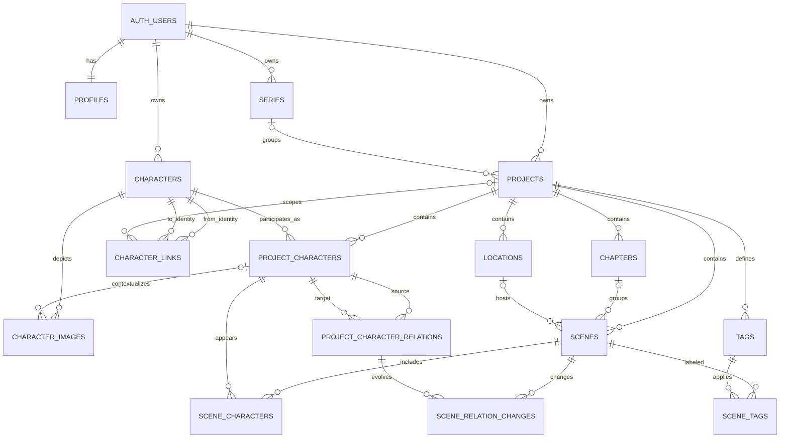

# Cloud Content Architecture

Status: architecture specification; no production schema or application changes are part of this document.

## 1. Goals

This specification defines the target relational model for Author Workspace content in Supabase and the safe path from the current per-project `localStorage` database. The design must:

- make the cloud database the source of truth without destroying the local recovery copy;
- preserve stable IDs, unknown safe metadata, strict dates, `dateReview`, and explicit migration conflicts;
- isolate every account through database and Storage policies, not frontend filtering;
- separate account-level character identity from its state in each project;
- keep structural links separate from directed emotional relations;
- support standalone projects, series, crossovers, spin-offs, and future collaboration;
- keep private authoring data structurally separate from future public publications;
- permit incremental implementation and rollback by small, independently tested phases.

Non-goals for this stage are SQL migrations, buckets, API changes, data transfer, production-code edits, and a full offline synchronization engine.

## 2. Current state

The existing cloud foundation contains:

- `auth.users` for authentication and `profiles` for account presentation;
- owner-scoped `series` and `projects`, with nullable `projects.series_id` and `position_in_series`;
- soft deletion for series/projects, a project `revision`, RLS, explicit authenticated grants, and security-invoker RPCs for series operations;
- a browser cloud API that loads only account, series, and project containers;
- a project-local namespace `authorWorkspace:project:<cloud-project-uuid>` and UI namespace `authorWorkspace:project-ui:<cloud-project-uuid>`.

The content source of truth is currently a version-11 local project object:

- `characters[]`: stable character ID plus display name and a small set of legacy fields;
- `profiles[characterId]`: profile fields, `photos[]`, `primaryPhotoId`, `hidden`, and `initialRelations`;
- `characterLinks[]`: structural graph edges;
- `chapters[]`, including the synthetic `chapter-unassigned`;
- `locations[]`, `tags[]`, and ordered `scenes[]`;
- `scene.people[characterId]`: `action`, `legacyState`, `relationChanges[targetId]`, and `visibleRelations[]`;
- `future`: currently flexible local placeholders.

The local safety pipeline is already a useful contract: parse -> detect version -> validate structure -> migrate -> detect conflicts/references -> normalize -> persist a copy -> replace in-memory state. Unknown own safe fields survive round trips; prototype-pollution keys do not. Recovery always previews and preserves the previous primary value. Cloud migration must retain these semantics.

Current profile fields are `name`, `surname`, `photos`, `race`, `sex`, `secondarySex`, `age`, `birthday`, `zodiac`, `height`, `build`, `profession`, `orientation`, `favorites[]`, `hobbies[]`, `character`, `features`, `description`, `hidden`, and `initialRelations`. `favorites` and `hobbies` remain arrays. Photo source and crop are separate, and unknown photo metadata survives normalization.

## 3. Domain model

The principal ownership boundaries are:

1. Account: profile, series, projects, and reusable character identities.
2. Project: chapters, scenes, locations, tags, project-character states, participation, and emotional history.
3. Contextual graph: a structural character link belongs either to the account-level canon or to one project context.
4. Publication: an immutable/snapshotted public projection created explicitly from a private project; it is never the private project itself.

`owner_id` remains denormalized on direct account roots (`series`, `projects`, `characters`) for clear ownership and efficient RLS. Project-owned descendants derive authorization through `projects`. The schema must prevent cross-owner references even when RLS is bypassed by a trusted backend; use composite ownership checks, constraint triggers, or narrow transaction functions where a plain FK cannot express the invariant.

## 4. Entity relationship overview

## 5. Tables

All UUID PKs use generated UUIDs for newly created rows but accept validated legacy UUID mappings through the import layer. All mutable tables have `created_at` and `updated_at` (`timestamptz`); triggers update `updated_at`. Flexible JSONB values must be objects and be copied with dangerous keys rejected. Unless stated otherwise, project-child rows hard-delete only after the parent project has passed its retention window.

### 5.1 Existing account and organisation tables

#### `profiles`

- Purpose: public-facing/account settings row separate from `auth.users`; never stores passwords, providers, tokens, or auth internals.
- PK/FK: `user_id` PK -> `auth.users.id` (`ON DELETE CASCADE`).
- Columns: `display_name`, `avatar_path`, `bio`, `settings jsonb`, timestamps. A future public `username` can be added with a case-insensitive unique constraint.
- Constraints/indexes: JSON object check and length checks; PK is sufficient for owner lookup.
- Delete: account deletion cascades after the account-deletion workflow and retention policy.
- RLS: `user_id = (select auth.uid())`; public profile reads, if later required, need a separate deliberately limited projection/view.

#### `series`

- Purpose: optional grouping and ordering context for projects, not a character owner.
- PK/FKs: `id`; `owner_id` -> `auth.users` (`CASCADE` only on final account deletion).
- Columns: `title`, `description`, `cover_path`, timestamps, `archived_at`, `deleted_at`. Existing `deleted_at` remains; adding `archived_at` distinguishes hidden-but-retained from trash.
- Constraints/indexes: nonblank title; `(owner_id, created_at desc) WHERE deleted_at IS NULL`.
- Delete: soft-delete first. Final deletion sets `projects.series_id` and `position_in_series` to null, then removes the series.
- RLS: direct owner check; future membership is not inherited merely because a user can access one project.

#### `projects`

- Purpose: private authoring workspace; standalone when `series_id IS NULL`.
- PK/FKs: `id`; `owner_id` -> `auth.users`; nullable `series_id` -> `series.id` (`SET NULL`). Same-owner series is enforced.
- Columns: existing title, description, position, status, settings, `revision`, timestamps, deleted timestamp; add `archived_at` and `schema_version`. The existing nonnegative `revision` is the single authoritative project-content version and should become `bigint` before content writes can approach the integer range. Do not add a parallel `content_version`.
- Constraints/indexes: position null without series; allowed status; `(owner_id, created_at desc) WHERE deleted_at IS NULL`; `(series_id, position_in_series)` partial active index. Do not add `series_projects` while a project belongs to at most one series.
- Delete: soft-delete/trash; purge later cascades project-only content. Never cascades to global `characters`.
- RLS: owner now; later centralize authorization behind a stable helper such as `private.can_access_project(project_id, minimum_role)` backed by `project_members`.

`project_members` is deferred. Adding it now increases policy and UX surface without a collaboration feature. Reserve roles `owner/editor/commenter/viewer`; keep all descendant policies expressed through a project authorization route so the predicate can be extended later without changing domain FKs.

### 5.2 Character tables

#### `characters`

- Purpose: one reusable account-level identity for the same fictional person across projects and series.
- PK/FKs: `id`; `owner_id` -> `auth.users`.
- Columns: queryable `name`, `surname`, `base_profile jsonb`, timestamps, `archived_at`, `deleted_at` (optional future trash), `metadata jsonb`.
- `base_profile`: stable/default attributes such as race, sex, secondary sex, birthday, orientation, default description, favorites, hobbies, and unknown safe profile fields. Fields are defaults, not immutable truth.
- Queryable columns: name/surname are columns. Promote another property only when a demonstrated query needs it; do not mirror every JSON field.
- Constraints/indexes: nonblank name; `(owner_id, lower(name), lower(surname))` non-unique search index; `(owner_id, updated_at desc)` partial active index. Names are intentionally not unique.
- Delete: archive by default. Final delete is `RESTRICT` while any `project_characters`, structural links, or images refer to it; a separate explicit purge workflow resolves those references.
- RLS: direct `owner_id = auth.uid()`. Later shared project access must not automatically expose the owner's entire identity library; collaborators receive only identities reachable through authorized project rows or a safe projection.

#### `project_characters`

- Purpose: participation and state of a global identity in one project.
- PK/FKs: `id`; `project_id` -> `projects` (`CASCADE` on purge); `character_id` -> `characters` (`RESTRICT`).
- Columns: `overrides jsonb`, `role`, `sort_order numeric`, `metadata jsonb`, timestamps, optional `archived_at`/`removed_at` for reversible removal.
- Constraints: `UNIQUE (project_id, character_id)`; JSON objects; same owner between project and character; nonnegative/valid sort ordering as chosen by UI.
- Indexes: `(project_id, sort_order, id) WHERE removed_at IS NULL`; `(character_id, project_id) WHERE removed_at IS NULL`.
- Effective profile: calculate `characters.base_profile` plus explicitly present keys from `project_characters.overrides` in the service layer (or a security-invoker view later). Do not persist a duplicated effective profile. An absent override key inherits the base value. A present non-null key replaces it for this project. A present key with JSON `null` is an explicit blank/none only for fields whose domain allows the user to clear or hide a base value; it is never inheritance.
- Override normalization/serialization: both profiles are JSON objects; reject dangerous prototype-pollution keys and preserve unknown safe keys. Normalize field values by the field contract (`favorites`/`hobbies` remain arrays). Remove an override key only for the UI action “use/restore shared value.” Preserve allowed explicit `null` keys through import, save, load, and export. Reject or surface a validation conflict for `null` on fields that do not support explicit blanking; never silently delete that key or reinterpret it as inheritance. Serialize sparse `overrides` exactly as explicit project choices rather than materializing inherited base keys.
- Delete: removal from a project must be an atomic guarded operation. Prefer `removed_at` if recovery is required; otherwise delete only after preview confirms the dependent participation and relation effects. It never deletes `characters`.
- RLS: through `project_id -> projects`; insert/update additionally proves the referenced character is owned by the project owner.

Birthday can remain in base profile while `age` may be a project override. A future scene-time age calculator can use strict `scene_date` plus birthday, but no generated/current age is stored now and no JavaScript `Date` normalization is permitted.

#### `character_images`

- Purpose: database metadata for original binaries in private Supabase Storage.
- PK/FKs: `id` is the stable photo ID; `character_id` -> `characters` (`RESTRICT` or `CASCADE` only during explicit identity purge); nullable `project_character_id` -> `project_characters` (`CASCADE`).
- Columns: `storage_path`, `mime_type`, optional dimensions/size/hash, `crop jsonb`, `caption`, `alt`, `sort_order numeric`, `is_primary`, `metadata jsonb`, timestamps, optional `deleted_at`.
- Context rule: `project_character_id IS NULL` means an identity-default image; non-null means a project-specific image and must reference the same `character_id`. This directly supports different photos/crops by book without duplicating identities.
- Constraints/indexes: unique stable photo ID; unique storage path; `(character_id, sort_order)`; `(project_character_id, sort_order)` partial; one active primary per identity-default context and one per project-character context via partial unique indexes. Keep crop and unknown safe metadata as JSONB.
- Delete: DB row soft-delete first for recovery; object cleanup is asynchronous after retention and must be idempotent. Removing a project-specific state may cascade its metadata but object deletion remains a controlled storage operation.
- RLS: identity-default rows through character ownership; project rows also through project authorization. Storage policy mirrors this ownership, never trusting a user-provided path alone.

#### `character_links`

- Purpose: one bidirectional semantic structural edge between two global identities; usable directly as a family-tree graph.
- PK/FKs: `id`; `owner_id` -> auth user; `from_character_id` and `to_character_id` -> `characters` (`RESTRICT`); nullable `project_id` -> `projects` (`CASCADE` on project purge).
- Columns: current `category`, `type`, `reverse_type`, `custom_label`, `reverse_custom_label`, `notes`, `structure_kind`, `metadata jsonb`, timestamps, optional `deleted_at`.
- Scope: `project_id IS NULL` is account-level canon; non-null is a project-context edge. Both endpoints must share `owner_id`; a scoped link's project must share it too.
- Constraints/indexes: no self-link; `(owner_id, from_character_id)`, `(owner_id, to_character_id)`, `(project_id, from_character_id)`, `(project_id, to_character_id)`, active partial indexes. A canonical semantic fingerprint (computed by application/transaction function) prevents forward/reversed duplicates within the same scope while allowing different relationship types for the same pair.
- Delete: project-scoped edges cascade only with project purge; global edges survive project deletion. Identity deletion is restricted while linked.
- RLS: direct owner plus, for future collaborators, project authorization only for scoped links. Global canon stays owner-private unless explicitly shared.

This single-table nullable-scope model is the MVP contract; no structural-link override engine is required. A global biological/family identity link may be inherited for presentation in projects that contain both endpoints. A project-scoped link may add contextual semantics or intentionally supersede how that pair is presented in that project, with conflicts resolved explicitly rather than by an implicit merge algorithm. Project-only legal, marriage, guardianship, or alternate-universe state must never be promoted to global scope or copied into other projects automatically. The UI must label “shared link” versus “this project only” and make any copy/promotion explicit and conflict-checked. A future temporal validity interval can be added without changing endpoints.

### 5.3 Project structure

#### `chapters`

- Purpose: project chapter metadata and order.
- PK/FKs: `id`; `project_id` -> `projects` (`CASCADE`).
- Columns: `title`, `position numeric`, `metadata jsonb`, timestamps, optional `deleted_at`.
- Constraints/indexes: unique `(project_id, id)` naturally; `(project_id, position, id) WHERE deleted_at IS NULL`.
- Delete: chapter removal sets active `scenes.chapter_id` to null, then soft/hard deletes the chapter. The local synthetic `chapter-unassigned` is not imported as a row.
- RLS: `chapter.project_id -> project authorization`.

#### `locations`

- Purpose: project-specific location library.
- PK/FKs: `id`; `project_id` -> projects (`CASCADE`).
- Columns: `name`, `description`, `metadata jsonb`, timestamps, optional `deleted_at`.
- Constraints/indexes: nonblank name; `(project_id, lower(name))` search index (not necessarily unique); active project index.
- Delete: `scenes.location_id ON DELETE SET NULL`; soft delete if referenced, with an explicit restore path.
- RLS: through project. A future `world_locations` identity plus `project_locations` state can be introduced later; current UUIDs and nullable FK do not block it.

#### `tags`

- Purpose: project-owned tag definitions.
- PK/FKs: `id`; `project_id` -> projects (`CASCADE`).
- Columns: `name`, `normalized_name`, optional color, `metadata jsonb`, timestamps.
- Constraints/indexes: `UNIQUE (project_id, normalized_name)`; normalize with one deterministic database/application rule (trim plus agreed Unicode/case policy), not locale-dependent browser behavior alone; `(project_id, name)`.
- Delete: hard delete is acceptable after confirmation; join rows cascade.
- RLS: through project.

#### `scenes`

- Purpose: atomic unit of chronology and manuscript text.
- PK/FKs: `id`; `project_id` -> projects (`CASCADE`); nullable `chapter_id` -> chapters (`SET NULL`); nullable `location_id` -> locations (`SET NULL`). Cross-project references are prohibited.
- Columns: `title`, `scene_text`, `scene_date date`, `scene_time time`, `placement_status`, `writing_status`, `included boolean`, `date_review boolean`, canonical `position numeric(20,10)`, `metadata jsonb`, timestamps, `deleted_at`.
- Strict date rule: invalid legacy date/time strings never normalize silently. Migration must block or retain them in migration staging/metadata with `date_review = true` until manual resolution; only valid calendar values enter typed columns. `date_review = true` always means user confirmation remains required.
- Constraints/indexes: status checks; `(project_id, position, id) WHERE deleted_at IS NULL`; `(project_id, chapter_id, position, id)`; `(project_id, scene_date, scene_time)` partial chronology index; full-text indexing is deferred.
- Delete: trash with `deleted_at`; dependent join/change rows remain until final purge or are hidden via parent visibility. Final purge cascades.
- RLS: direct project route; update checks prevent moving a scene to another unauthorized project.

#### `scene_tags`

- Purpose: normalized many-to-many scene tagging.
- PK: composite `(scene_id, tag_id)`; FKs to scene/tag (`CASCADE`).
- Columns: optional `created_at`; no JSON payload unless a real per-assignment feature appears.
- Constraints/indexes: PK plus `(tag_id, scene_id)` for reverse lookup; scene and tag must belong to the same project.
- RLS: `scene_id -> scene -> project`; write also verifies tag belongs to that project.

#### `scene_characters`

- Purpose: project-character participation in a scene.
- PK/FKs: either UUID `id` plus `UNIQUE (scene_id, project_character_id)`, or composite PK; `scene_id` and `project_character_id` both `CASCADE` on final parent purge.
- Columns: `action`, `legacy_state`, `sort_order numeric`, `metadata jsonb`, timestamps.
- Constraints/indexes: same project for both FKs; `(scene_id, sort_order, project_character_id)`; `(project_character_id, scene_id)`.
- Delete: participation deletion must account for relation changes sourced by that character in the scene; use an atomic service operation and preview.
- RLS: through scene/project, with a same-project write check.

### 5.4 Emotional relations

#### `project_character_relations`

- Purpose: explicit directed relation at project start. A -> B and B -> A are distinct.
- PK/FKs: `id`; `project_id` -> projects (`CASCADE`); `from_project_character_id`, `to_project_character_id` -> project characters (`CASCADE`).
- Columns: nullable `value_operation` (`set`/`clear`), nullable `value text`, nullable `visible boolean`, `metadata jsonb`, timestamps. `value_operation` makes field presence explicit: `set` requires a value, `clear` requires null value, and null means no explicit initial value. Nullable `visible` is the same presence contract for visibility. Require at least one of `value_operation` or `visible` to be non-null; absence of a row means neither field has explicit initial state.
- Constraints/indexes: no self-relation; `UNIQUE (project_id, from_project_character_id, to_project_character_id)`; both endpoints belong to project; indexes on both endpoint directions.
- Delete/RLS: cascade with project/project-character removal; RLS through project.

#### `scene_relation_changes`

- Purpose: explicit directed change at one scene; absence means inherit. Visibility is metadata on the same directed A -> B emotional relation, never a separate relation type. A row may change value only, visibility only, or both, and must distinguish “set text” from “clear relation.”
- PK/FKs: `id`; `scene_id` -> scenes (`CASCADE`); `project_relation_id` -> project-character relation (`CASCADE`), or direct endpoints. Recommended: store direct `from_project_character_id` and `to_project_character_id` rather than require an initial row, because a relation may first appear mid-story; optionally expose a derived relation key.
- Columns: `from_project_character_id`, `to_project_character_id`, nullable `value_operation` (`set`/`clear`), nullable `value`, nullable `visible boolean`, `metadata jsonb`, timestamps. `value_operation IS NULL` means the value field is absent/inherited for this change; non-null `visible` explicitly replaces visibility, while null means visibility is absent/inherited. Require at least one of `value_operation` or `visible` to be non-null; `set` requires a value and `clear` requires null value.
- Constraints/indexes: no self; one change per scene/direction; endpoints and scene share a project; `(scene_id, from_project_character_id, to_project_character_id)` unique; `(from_project_character_id, to_project_character_id, scene_id)` for history.
- Delete/RLS: cascade with scene/project-character final deletion; through scene -> project. Changes are applied in scene `position` order, never array order or date order.

Replay follows canonical scene `(position, id)` order. For each direction, every explicitly present field replaces its prior state and every absent field inherits it: a value-only row leaves visibility unchanged, a visibility-only row leaves value unchanged, and a combined row changes both. A visibility-only change does not create a fictitious relation value. Migration preserves `visibleRelations` as explicit visibility metadata even when no value changes in that scene.

## 6. Character identity vs project state

An identity answers “who is this across the account?” A project character answers “how does this identity appear in this manuscript?” Example:

- one `characters` row for Vanya, owned by the account;
- Book 1 `project_characters.overrides`: age 17, pupil, project-specific photo;
- Book 2 overrides: age 22, student;
- Book 3 overrides: age 35, married, different profession.

The identity is not owned by a series. Linking projects to and from a series does not alter character ownership. `characters.base_profile` holds identity defaults; `project_characters.overrides` is sparse and holds only explicitly overridden keys. The effective profile is computed as base plus overrides and is not duplicated. The future UI must distinguish “uses shared value,” “overridden for this book,” and “restore shared value”; the last action removes the override key rather than writing null. Project role/order are relational columns; images and relations have dedicated tables.

Hybrid JSONB is intentional. Flexible questionnaire data, hidden/custom fields, and plugin metadata evolve frequently and round-trip well in JSONB. IDs, ownership, project membership, ordering, links, relations, tags, and scenes require relational constraints and indexes. The final architecture must not store the entire project as one authoritative JSONB blob; a snapshot blob is acceptable only as import staging, backup, or cache.

## 7. Structural links

Structural links and emotional relations have different lifecycles and never share a table. One structural row stores both forward and reverse semantics. It is a graph edge, so family tree rendering/inference queries it directly; no family-tree business table is added.

Recommended scope rules:

- usually global: biological parent/child, sibling, grandparent, biological extended family;
- often contextual: marriage/ex-marriage, guardianship, adoption/legal status, and alternate-universe relationships;
- user chooses scope explicitly, with sensible category defaults but no silent classification.

Uniqueness is per scope (`global` or a specific project). A transaction validates both endpoints, self-links, same owner, reversed semantic duplicates, and safe metadata before replacing an edge. Editing an edge is atomic. Converting scope is explicit and conflict-checked.

## 8. Emotional relations

Initial directed states belong to the project. Explicit scene changes are replayed by scene position to obtain inherited state. Empty legacy change values map to `value_operation = clear`, not a missing row. This preserves current behavior when scenes move: the explicit change travels with its scene, while inherited results recompute.

Initial state and scene changes use one directed A -> B relation contract containing independently optional value and visibility fields. Visibility is not a relation type. During replay, only fields explicitly supplied by a row replace prior fields; omitted fields inherit. This permits value-only, visibility-only, and combined changes without fabricating content.

The API should expose `getRelationsBefore(sceneId)`/`getRelationsAt(sceneId)` as a repository query or RPC only after profiling. Do not persist every computed state per scene in MVP; it duplicates derived values and makes reorder invalidation expensive.

## 9. Scene ordering

The project has exactly one canonical scene order. It is stored in `scenes.position` and read as `(position, scene.id)` so the stable scene ID is the deterministic tie-breaker. `chapter_id` is a grouping attribute, not an independent ordering system. Moving a scene within or between chapters updates its canonical position; a cross-chapter move updates `chapter_id` and `position` atomically.

Options considered:

- Dense integers are simple but rewrite many rows on every insertion/reorder.
- Fractional `numeric` positions insert between neighbors cheaply, but gaps eventually become too small.
- Lexicographic rank keys scale well but add a ranking algorithm and collation/validation concerns.
- Any sparse strategy still needs periodic normalization.

MVP uses fractional `numeric(20,10)` positions with initial gaps (for example 1024). A move transaction locks/validates canonical neighbors and assigns a midpoint. Do not add `global_position` and `position_in_chapter`: two writable orders could diverge. When no safe midpoint remains or a batch reorder requires it, a dedicated transactional normalization RPC renumbers the project's active scenes while preserving `(position, id)` order and bumps the project revision once. Normalization is a separate operation, never an incidental partial rewrite.

## 10. Images and Storage

Use a private bucket such as `character-originals`. Store only original binary objects; crop remains metadata and never overwrites the original. A deterministic user-isolated object path is recommended:

`<owner_uuid>/characters/<character_uuid>/<photo_uuid>/original.<safe_ext>`

The database owns the mapping from photo ID to path. The client never derives authorization solely from the path. Upload flow:

1. validate size/type and create photo ID;
2. upload original to the private path;
3. atomically register metadata (or remove the object if DB registration fails);
4. set primary state transactionally within the identity/project context;
5. serve via authenticated download or short-lived signed URL.

Storage policies restrict `storage.objects` by bucket and first path component equal to `auth.uid()`, plus application ownership checks where practical. Upsert needs select/insert/update policies, but immutable original paths are preferable: replace by uploading a new object/photo ID. Delete is delayed and coordinated with DB soft delete. Series/profile covers should use separate folders or buckets and separate policies. No private character image becomes public because a project is published; publication copies explicitly selected assets into a publication-owned public/private delivery area.

## 11. RLS and security

Enable RLS on every exposed content table and explicitly grant only required operations to `authenticated`. Data API grants and RLS are separate; new Supabase projects may not expose new tables automatically, so migrations must contain deliberate grants. Never ship `service_role`, secret keys, database credentials, or personal tokens to the browser.

Policy routes:

| Table | Authorization route |
|---|---|
| profiles | `user_id = auth.uid()` |
| series, projects, characters | direct `owner_id = auth.uid()` |
| project_characters, chapters, scenes, locations, tags, initial relations | row `project_id -> projects.owner_id` |
| scene_characters, scene_tags, scene_relation_changes | join row -> scene -> project |
| character_images | character owner; project-context row also validates project access |
| global character_links | `owner_id`; scoped links additionally validate project access |

All `UPDATE` policies need both `USING` and `WITH CHECK`, plus a corresponding select policy. `TO authenticated` alone is never authorization. Avoid authorization from user-editable JWT metadata. Prefer security-invoker functions. If a security-definer function becomes unavoidable, place it in a non-exposed schema, revoke public execution, set an empty search path, check `auth.uid()` internally, and test it as an API surface.

Indirect insert/update policies must validate both sides of a join so a user cannot attach their row to another user's ID. RLS tests use two authenticated users and attempt select/insert/update/delete plus FK-ID guessing for every route. User A must never observe or mutate User B content through direct tables, joins, RPCs, views, Realtime, or Storage.

Future collaboration should replace the owner predicate inside a common authorization helper, not add ad hoc policies. Owner operations remain stronger than editor/commenter/viewer. Public publication reads use different tables/policies and never weaken private project RLS.

## 12. Soft delete and cascade behavior

User-visible roots and expensive content use trash; pure joins can hard-delete.

| Parent/action | Behavior |
|---|---|
| series archive/delete | `archived_at`/`deleted_at`; projects are retained and may be detached; final FK is `SET NULL` |
| project delete | set `deleted_at`; after retention, purge project-only descendants with `CASCADE`; preserve global identities and global links |
| character delete | archive first; final delete `RESTRICT` while used by project states, links, or images |
| remove character from project | preview dependents; atomic soft-remove/delete of project state, scene participation, emotional relations, and project-scoped images/links; global identity survives |
| scene delete | `deleted_at`; final purge cascades scene tags, participation, and relation changes |
| chapter delete | scenes `SET NULL`; chapter removed/trashed |
| location delete | scenes `SET NULL` |
| tag delete | scene-tags `CASCADE` |
| identity image/link | retain/soft-delete; explicit object cleanup or conflict-aware edge removal |

Queries and uniqueness rules must consistently define whether deleted rows participate. Restoring a row must detect uniqueness conflicts and show a preview rather than silently overwrite the active row.

## 13. Local migration

### 13.1 Safe flow

1. Open/authenticate a cloud project and read its cloud content manifest/version.
2. Inspect `authorWorkspace:project:<cloudProjectId>` read-only.
3. Run the existing parse/version/validation/migration/normalization pipeline without mutating local or cloud state.
4. Build a preview: counts, invalid references, manual conflicts, proposed identity mapping, dates requiring review, image bytes, and whether cloud is empty/divergent.
5. If cloud contains content, require an explicit choice (cancel, import into empty only, or a later merge workflow); never overwrite automatically.
6. Ask the user to confirm the complete mapping/import.
7. Submit one idempotent import manifest to a transaction/RPC or trusted backend transaction. Use an `import_id`/idempotency key and expected project revision.
8. Insert/validate all rows; increment project revision only on commit.
9. Read back a manifest/checksums/counts and compare with the preview.
10. Mark the local namespace as a synchronized recovery/cache copy with sync metadata. Do not delete or rewrite the original payload destructively.

No partial import becomes visible. For large images, stage objects first under an import prefix; the database transaction registers only successfully uploaded objects. Failed/unreferenced staged objects are safe to clean after retention. Preserve a local pre-import snapshot regardless.

### 13.2 Exact mapping for one V11 project

| Local | Cloud mapping |
|---|---|
| `characters[]` + `profiles[id]` | create one `characters` identity and one `project_characters` row per stable local character ID; split base fields and project overrides according to the confirmed import policy |
| `profiles[id].photos[]` | upload original `source` binary; create `character_images` retaining photo ID, crop, caption, alt, order, primary context, and unknown safe metadata |
| `profiles[id].initialRelations[targetId]` | resolve local IDs to project-character IDs; create directed `project_character_relations` |
| `characterLinks[]` | resolve endpoints to global identities; preview scope; import as project-scoped by safe default unless user explicitly promotes canon-global |
| `chapters[]` | skip `chapter-unassigned`; create chapters and positions; map that ID to SQL null |
| `locations[]` | create project locations with stable mapped IDs |
| `tags[]` | create tags with normalized names; duplicates are conflicts, not silent merges |
| ordered `scenes[]` | create scenes with explicit sparse positions; map chapter/location; keep text, statuses, included and `dateReview` |
| `scene.tags[]` | create `scene_tags` after resolving stable tag IDs |
| `scene.people[characterId]` | create `scene_characters` linked to `project_character_id`; map action, legacy state and order |
| `people[id].relationChanges[target]` | create directed scene changes; empty string -> explicit clear; retain visibility semantics |
| unknown safe fields / `future` | preserve in scoped `metadata` or an import snapshot/staging record; do not scatter unknown project-root data without a documented owner |

Stable local IDs may already be non-UUID strings. Do not coerce or discard them. Use an import mapping (`legacy_id -> cloud_uuid`, scoped by import/project/entity type), retained in import metadata or a dedicated temporary/permanent mapping table. Cloud-facing relations use UUIDs; exports can include original legacy IDs in metadata for traceability.

### 13.3 Identity matching and deduplication

Never deduplicate by name. Names are mutable and non-unique.

For the first project import, the safest MVP is a pre-import mapping screen: each local character defaults to “create new identity,” with an explicit “use existing identity” search. This is slightly more work than always creating identities but avoids creating a duplicate Vanya when the second related project is imported. It also avoids a risky post-import merge as the only remedy.

If scope must be reduced for initial delivery, default-create identities and provide a later transactional merge/relink flow. Such a merge must preview every project state, image, link, and relation conflict. It cannot silently combine base profiles. The mapping screen is the recommended target.

## 14. Cache/offline and conflict strategy

Cloud DB is authoritative. `authorWorkspace:project:<projectId>` remains a recoverable cache; its companion metadata should include:

- `schemaVersion`, `cloudRevision`, `lastSyncedAt`, and a server snapshot hash/ETag;
- `dirty` plus a durable queue of explicit pending operations (not merely a boolean) once offline editing is enabled;
- last known server `updated_at`/version and client/device ID;
- a preserved last-synced snapshot for three-way manual comparison.

MVP cloud rollout may be online-only writes with read cache/recovery fallback. Do not advertise offline edits until durable replay and conflict UI exist. Retry operations with idempotency keys and exponential backoff; never retry validation/authorization conflicts blindly.

Optimistic concurrency uses project `revision` (monotonic bigint target type) as the coarse guard and row `updated_at`/optional row version for precise edits. A content transaction accepts `expected_revision`; mismatch returns a conflict without writes. Every successfully committed transaction that changes project content increments `revision` exactly once and returns the new value; rejected or rolled-back writes do not increment it. Laptop/phone divergence shows server, local pending changes, and last common snapshot for manual choice. Do not implement CRDT now. Scene text conflicts require explicit keep-local/keep-cloud/copy-both resolution; metadata fields may later support field-level merges.

`schema_version` describes data shape, while `revision` is the content version and changes on committed content mutations. `updated_at` is informative, not a sufficient concurrency token because clocks and multi-row operations differ. Container-only updates must be classified before implementation: content-affecting project metadata participates in the same revision protocol; purely operational fields such as a maintenance timestamp do not. There must not be a second independent `content_version` counter.

### Existing `projects.revision` audit and decision

The cloud-foundation migration `20260812193655_cloud_foundation.sql` creates `projects.revision integer NOT NULL DEFAULT 0` with a nonnegative check, so the column exists in the production schema represented by repository migrations. The browser cloud API fetches it only incidentally through `projects.select("*")`; neither application code nor tests explicitly consume its value. Project creation relies on the default. The existing project RPCs (`set_project_series`, `reorder_series_projects`, and the project-detaching part of `archive_series_keep_projects`) update project rows without incrementing revision. There is no compare-and-swap predicate, `expected_revision` argument, stale-write rejection, or other working optimistic-concurrency flow. The earlier foundation document describes revision only as a reserved future revision/conflict contract, with no second meaning.

Decision: retain the existing column name `revision` and formally define it as the sole project-content concurrency counter. The first content SQL phase may widen it from `integer` to `bigint` and must add transactional increment/expected-revision behavior, but must not add `content_version`. Existing container RPCs must be classified and updated consistently when this protocol is implemented; this documentation stage does not alter them.

### Atomic operation boundaries

- Create/update scene plus tags, participation, and relation changes.
- Save character base and/or project overrides, including primary-image invariants.
- Remove character from project with all project-only dependents.
- Whole-project import with expected version and idempotency key.
- Reorder/move scenes (all affected positions plus one revision bump).
- Create/edit/move-scope structural link with duplicate validation.

Use narrow Supabase RPCs/Postgres transactions for these multi-row operations. Simple single-row reads may use the Data API. Functions should be security invoker where RLS suffices, validate expected versions, and return the new version plus affected IDs.

### API boundary

UI modules must not scatter raw Supabase calls. Recommended layering:

- repositories: `project-content-repository`, `characters-repository`, `scenes-repository`, `relations-repository`, `images-repository` own table/query details;
- services: migration, effective-profile merge, scene save/reorder, character removal, link edit, and upload orchestration own transactions and domain validation;
- cache adapter: current safe local persistence and sync metadata;
- UI controllers consume domain DTOs and error types, not Supabase result objects.

Keep validation, version detection, migration, normalization, persistence, and state replacement separate and side-effect controlled.

## 15. Future publication platform

A private `project` is an authoring workspace and can never become public directly. A `publication` is a separate explicit public product, and each release is an immutable/curated publication revision snapshot with deliberately copied fields and selected assets. No public policy, view, or API may expose authoring project tables as a shortcut.

Private-only by default includes internal notes, character hidden fields, structural/internal relationship notes, emotional relations, timeline metadata, `dateReview`, internal tags, and draft scene states. These fields are excluded unless a future publication workflow defines an explicit safe public projection for a particular field; merely publishing scene prose does not publish adjacent authoring metadata.

Future model (not MVP migration):

- `publications`: owner, public slug/title/description/cover, visibility/status, current revision; references source project only through a private management FK (`RESTRICT`/`SET NULL` according to retention).
- `publication_revisions`: immutable publication snapshot/version, release timestamps, manifest; `CASCADE` from publication only through explicit unpublish/purge policy.
- `published_chapters`: revision-owned ordered public chapter/content snapshots; no live FK read path into mutable private scene text.
- `ratings`: one score per user/publication, timestamps; unique pair, moderation rules.
- `reviews`: user/publication, body/status, timestamps, soft delete/moderation.
- `library_entries`: user/publication and state (saved/reading/completed), unique pair.
- `comments`: publication/revision/chapter target, author, parent comment, moderation and soft delete.
- `follows`: follower -> profile/publication/series public subject using explicit typed tables or constrained subject model; no access implication for private data.

Public RLS reads only published revisions and deliberately copied assets. Authoring RLS never gains an `anon` policy. This separation supports revisions, takedowns, moderation, and stable reader experiences while private projects continue changing.

The current identity/project split also supports one character across multiple series, crossovers, spin-offs, standalone-to-series movement, and different project states. Publication can later choose whether to expose a publication-specific character projection; it must not expose `characters.base_profile` directly.

## 16. Implementation phases and testing

Each phase is a separate small task, migration, review, and commit. Every schema phase includes explicit Data API grants, RLS, indexes, rollback/recovery notes, and generated fixtures.

### Phase 1 — schema and security foundation

Add the decided revision semantics, shared authorization helper design, common timestamp/metadata conventions, and content tables that later phases need, initially unused by production UI. Implement canonical scene ordering and nullable structural-link scope constraints as specified above.

Tests: migration lint/unit assertions, local DB migration up/down-on-fresh checks, owner and cross-user RLS matrix, FK cross-owner attacks, grants/advisors.

### Phase 2 — chapters, scenes, locations, tags

Implement repositories/services and cloud reads/writes for project structure, including null unassigned chapter, sparse reorder RPC, strict date handling, scene tags, trash, and optimistic concurrency. Gate rollout per project.

Tests: unit mapping/date/order tests; DB transaction and constraint tests; RLS for direct and join tables; browser create/edit/delete/backdrop/Escape/save-failure/accessibility flows; reorder across chapters; User A/B isolation.

### Phase 3 — character identity and project state

Add reusable identities, project states, effective-profile merge contract, role/order, and guarded removal without images/relations initially. Build explicit choose-existing/create-new UI.

Tests: JSONB merge/null semantics, unknown metadata round trips, cross-project identity reuse, same-owner constraints, RLS that does not expose an owner's whole library to future collaborators, editor dirty/failure/accessibility browser tests.

### Phase 4 — scene participation and emotional relations

Add participation, directed initial relations, explicit set/clear scene changes, inheritance by position, and visibility parity.

Tests: directed asymmetry, reorder inheritance, clear semantics, atomic scene save, endpoint project mismatch, RLS joins, browser parity with current relation UI.

### Phase 5 — structural links

Add global/project-scoped graph edges, duplicate fingerprint rules, scope UI, and transactional editing/promotion.

Tests: self-link, reverse duplicate, different-type allowance, unknown metadata, cross-owner endpoints, global versus scoped visibility, family-tree graph fixtures, modal/accessibility regression.

### Phase 6 — character images and private Storage

Add image metadata, project context, original upload, crop, primary invariants, signed display, retry/orphan cleanup.

Tests: photo ID/crop/unknown metadata round trip, primary uniqueness, upload failure compensation, MIME/size policy, Storage cross-user path attacks and signed URL isolation, browser original-preservation/crop/failure flows.

### Phase 7 — local project migration

Build read-only discovery, preview, identity/scope mapping, idempotent transactional import, staged image upload, verification, and retained cache/backup. Begin with empty cloud targets only unless a separately designed merge exists.

Tests: fixtures for V10->V11 and every conflict, legacy IDs, corrupt/unknown data rejection, no default fallback, ambiguous names/manual references, invalid strict dates, duplicate tags/links, injected transaction failures at each step, retry idempotency, local backup preservation, full browser confirmation/cancel/recovery flows.

### Phase 8 — cross-device verification and cache

Make cloud the default read source, retain last-good cache, add expected-version writes, conflict UI, retry behavior, and multi-device simulations. Offline editing remains disabled until its operation queue passes durability tests.

Tests: two-browser/device convergence, stale version rejection, network loss at read/write/verification boundaries, manual conflict resolution, retry without duplicates, cache recovery, User A/B browser isolation.

Every phase runs unit tests, local Supabase integration tests, all applicable RLS/advisor checks, browser regression, and accessibility tests. Production database tests must not mutate real user data.

## 17. Open decisions

1. Whether project-character removal is soft (`removed_at`) in MVP or handled by project/import snapshots plus hard join deletion.
2. Legacy-ID mapping retention: permanent import provenance table versus scoped metadata. A provenance table is preferable if exports/diagnostics need reliable lookup.
3. Structural-link import default and mapping UX: project scope remains the safe default; decide whether preview offers bulk promotion for clearly canonical biological links.
4. Image upload transaction coordinator: browser orchestration with staged objects versus an Edge Function. Decide from file-size/auth/retry requirements; never use a frontend service-role key.
5. Retention periods and account-deletion/legal requirements for trash and Storage objects.
6. Detailed offline merge behavior beyond stale-revision rejection and manual conflict handling.
7. Collaboration roles, timing, and whether identity-library sharing needs an explicit per-identity grant model.
8. Publication moderation, takedown, and review policy for the later public platform.
9. Whether automatic family inference is ever offered, and its explicit preview/confirmation rules; it is not part of the MVP structural-link model.

## 18. Risks

- A too-flexible JSONB profile can become unqueryable; mitigate by promoting only proven query fields and versioning merge semantics.
- Cross-owner references can bypass conceptual ownership if only frontend checks exist; enforce same-owner/project invariants in DB and attack-test them.
- RLS on indirect joins is easy to under-specify and can cause BOLA/IDOR; test every CRUD route with two users.
- Global versus contextual structural scope may confuse users; show scope explicitly and never auto-promote.
- Legacy non-UUID IDs, duplicate names, invalid references, and invalid dates can cause silent loss; retain mapping, preview, and manual conflicts.
- Image upload and DB commit are not one native transaction; staging, idempotency, verification, and orphan cleanup are required.
- Fractional positions need controlled normalization and concurrent-move protection.
- Replaying relations can become expensive for very large projects; add indexes first, profile, then consider snapshots without making them authoritative.
- Coarse project conflicts may be frequent; start safe, then add row-level conflict precision rather than premature CRDT.
- Publication shortcuts could leak private data; public reads must use separate revision-owned tables and assets.
- Supabase Data API defaults evolve: explicit grants and RLS remain mandatory and must be verified against current Supabase documentation during implementation.

## 19. Architectural acceptance criteria

The next SQL-schema task should be able to derive every table, FK direction, ownership route, delete rule, and core index without deciding the domain model anew. Canonical scene order, sparse override/null semantics, emotional visibility changes, the authoritative `revision`, nullable character-link scope, and the publication boundary are closed decisions. Remaining open questions are scoped to their later implementation phases. No implementation phase starts automatically from this document.
